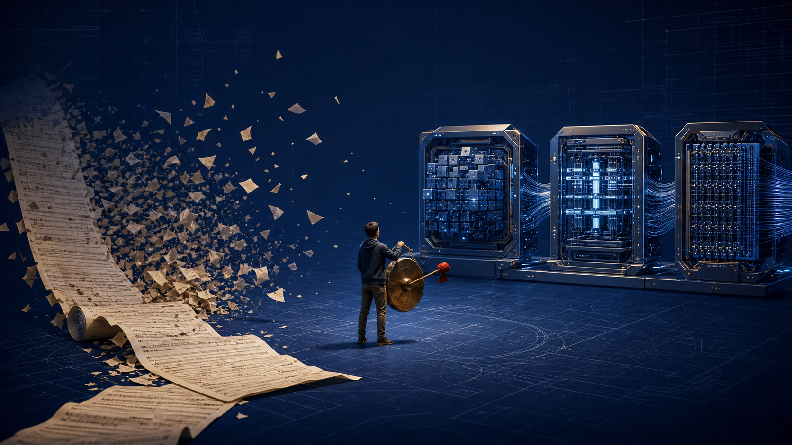

# 2Origin Computer Architecture

**本源计算架构 · An open architecture for persistent AI computers.**

> We don't build models. We want to build an AI computer.
> The model is the CPU — but a CPU is never a computer.
>
> 我们不造模型，我们想造一台 AI 计算机。模型是 CPU，但 CPU 从来不等于一台计算机。

**Status:** Draft · Request for Comments · v0.1
**License:** Apache-2.0
**Principle:** Model is replaceable. State survives. Actions are portable. Learning compounds.

---



## Open Challenge · 长程 AI 计算机正式接榜

Traditional AI can start many tasks. The harder question is whether it can still know the current
state after days, sessions, model swaps, failed actions, and retracted decisions.

We are opening the architecture to real long-running tasks: large document projects, multi-session
software work, persistent research, multimodal archives, and anything that makes an agent forget
what is true halfway through.

公司很小，胃口很大；宣传部只有一个人，所以锣可能敲得响了一点。我们不要求你先相信：
代码、实验、失败和撤回都公开。欢迎出题，也欢迎把这条路线打穿。

- **[Read the challenge announcement / 接榜令](https://blog.hequbing.com/post?slug=long-term-ai-computer-challenge)**
- **[Submit a long-running task / 提交挑战](https://github.com/dongsheng123132/2origin-computer/issues/new?template=long-task-challenge.yml)**
- [Challenge rules](docs/challenge-rules.md) · [Evidence and limits](docs/evidence-and-limits.md)

> “World-first long-term AI computer prototype” is the initiator's falsifiable public claim,
> not a third-party certification. Earlier comparable public implementations are welcome as evidence;
> verified counterexamples will change the wording in public.

---

## The Problem

Today's agent stack has good parts: models (CPU), Context Windows (RAM), MCP (buses), and harnesses (kernels). But they don't assemble into **one computer** — the motherboard, disk, drivers, and OS are missing.

The universal pain point:

> **Taught today, forgotten tomorrow. Learned on this task, restarting from grade one on the next Session.**

Because agents persist **chat transcripts** (shadows), not **object state** (origin).

## The Architecture: An AI Computer

| Layer | PC analogue | This system | Responsibility |
|---|---|---|---|
| Intelligence | CPU | **Model** (swappable) | reasoning |
| Working memory | RAM | **Context Window** | current thinking |
| Long-term storage | SSD | **Xueji 学籍** | everything the AI learned |
| Sensing | sensor hub (Southbridge I/O, in) | **Quxiang 取象** | reads the world — and never receives an expectation |
| World representation | GPU | **Benxiang 本象** | world → AI-computable objects |
| Machine environment | CMOS / firmware settings | **Benjing 本境** | what this machine has and can run |
| Action I/O | Southbridge I/O, out | **Action Kernel 影核** | changing the world |
| High-speed bus | Northbridge | **Northbridge 北桥** | state → Context |
| Kernel | BIOS + Kernel | **Harness** (swappable) | scheduling |
| Self-learning | system service | **Academy 学堂** | experience → credentials |
| The machine | PC | **U-King** | first reference implementation |

> **Quxiang sees the world. Benxiang saves it. Xueji keeps the record. The Action Kernel changes it.**
> **The Northbridge knows. The Southbridge acts.**

> **Naming:** Quxiang (sensing) and Benxiang (representation) were one name until
> [`NAMING-DECISION.md`](NAMING-DECISION.md) split them — *take the image, then establish it*.
> If you have read an earlier draft where "Benxiang" meant the observer, that is the one it renamed.

Full loop: `Observe → Think → Act → Verify → Learn`

Read the full spec: **[RFC-0000 — 2Origin Computer Architecture](rfcs/RFC-0000-2origin-computer.en.md)** · [中文版](rfcs/RFC-0000-2origin-computer.md)

---

## Verified by first-run evidence (2026-08-08)

> First-run pass = signal the architecture is right (not a benchmark-tuned result).

### ✅ Cross-Session — close the window, resume the task
A fresh, independent Claude Code session (`claude -p`, zero prior conversation) received the `task.origin.json` summary automatically via a SessionStart hook and **reported the task title and goal correctly**.

### ✅ Cross-Harness — swap the engine, keep the credentials
Claude Code did half the task (distilled 12 facts). Codex (`codex exec`) continued from only `task.origin.json` + facts with **zero re-asking**. Session logs confirm Codex never asked "what is the task?"

### ⏳ Known limitation: write access for headless harnesses
Codex's sandbox is read-only. The fix is a **Southbridge write action** — an audited MCP tool (`southbridge_write`, whitelist + audit log) injected into the harness. Prototype self-tests pass (write / path-traversal denial / audit log); injection into Codex confirmed. Final end-to-end test is blocked by an expired Codex login token (environment issue, not architecture). This is the Southbridge/Trust layer's job.

---

## Repository layout

```text
2origin-computer/
├── README.md                      ← you are here
├── docs/                          ← challenge rules and evidence boundaries
├── rfcs/
│   ├── RFC-0000-2origin-computer.en.md    ← full spec (EN)
│   └── RFC-0000-2origin-computer.md       ← full spec (中文)
├── schemas/                       ← state format JSON Schemas (task.origin, ...)
├── examples/                      ← reference implementation examples
├── conformance/                   ← conformance checklist
├── LICENSE                        ← Apache-2.0
└── TRADEMARKS.md                  ← trademark boundaries
```

## How to contribute

- Read [RFC-0000](rfcs/RFC-0000-2origin-computer.en.md)
- Pick an open question from §10: Benjing layering / Northbridge Context compiler / Southbridge write authorization / Academy promotion thresholds
- Open an Issue or PR

## Trademarks

U-King, 2Origin, Benxiang, Benjing, ActionParity, Academy, and OriginBus are trademarks (brand names; the technical terms are Origin IR / Sensor / State Layer / Machine Profile / Action Kernel / Northbridge) — see [TRADEMARKS.md](TRADEMARKS.md). Code is Apache-2.0; the trademark license is separate.

---

## 中文速览

我们不造模型，我们想造一台 **AI 计算机**。模型是 CPU，但 CPU 从来不等于一台计算机。

本架构定义持久 AI 计算机的一层：**模型可换，状态不丢，动作可迁移，经验会复利。** 模型/Context/Harness/MCP 都已是现成零件，缺的是把它们装成一整台机器的**主板、硬盘、驱动和操作系统**。

- **取象**看见世界，**本象**保存世界，**学籍**保存成长，**影核**改变世界（英文 Action Kernel）
  （取象/本象曾共用一个名字，裁决见 [`NAMING-DECISION.md`](NAMING-DECISION.md)：先取象，后立象）
- **北桥**负责知，**南桥**负责行
- 闭环：`Observe → Think → Act → Verify → Learn`
- **U-King** 是第一台参考整机
